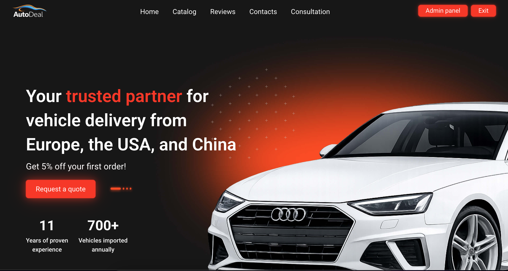
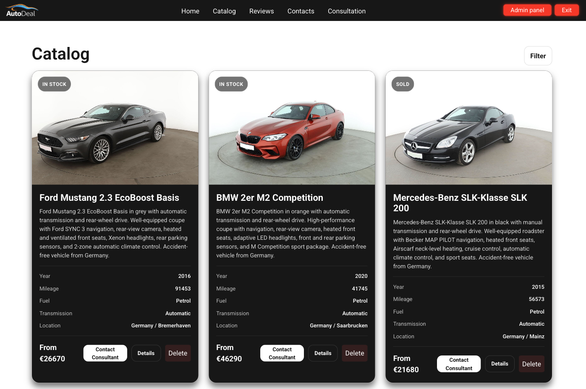
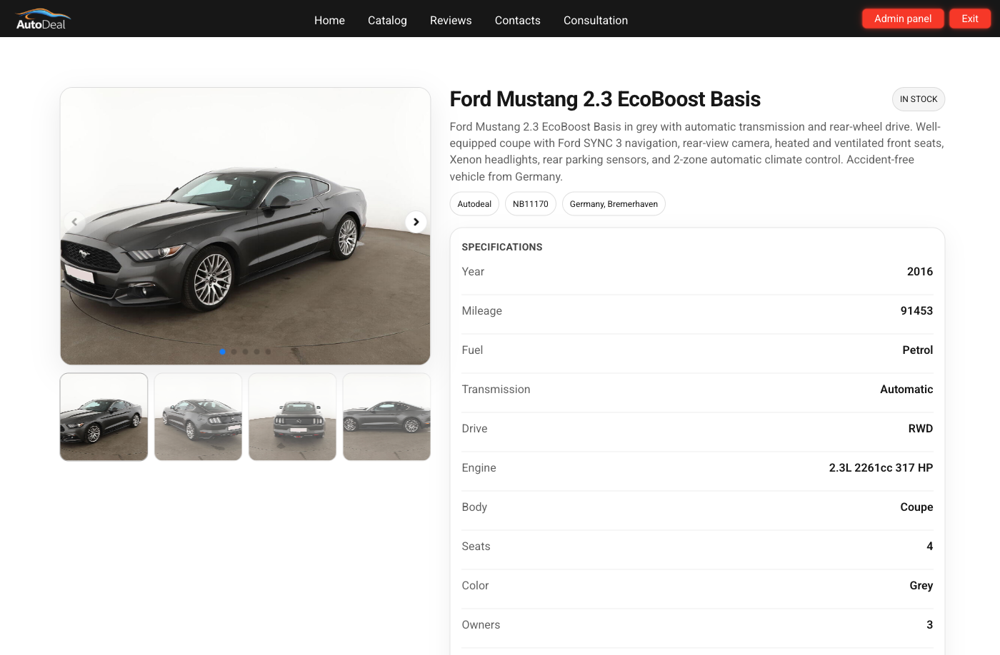
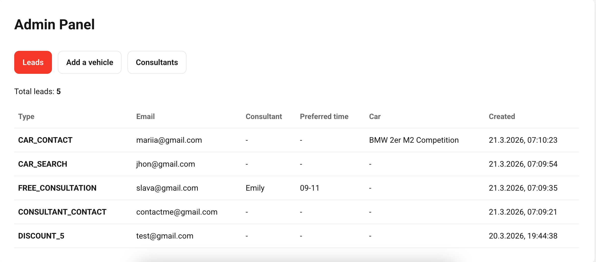
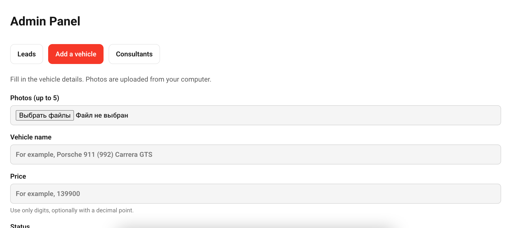
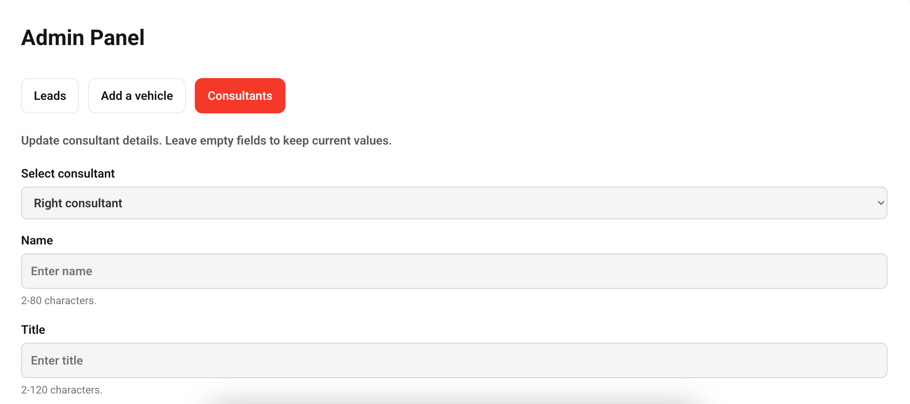
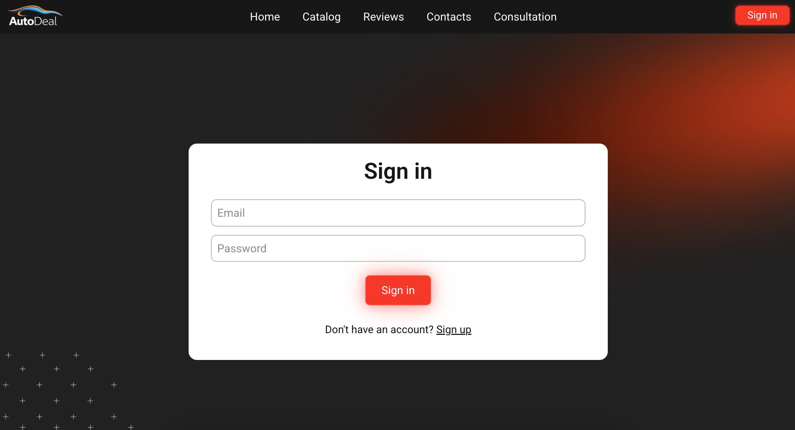
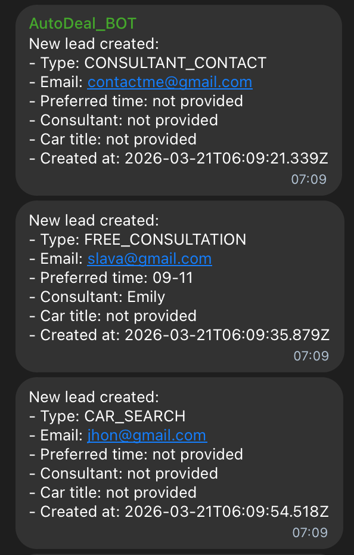

# AutoDeal Frontend

**Live Demo:** https://autodeal.business/  
**Backend Repository:** https://github.com/ViacheslavOl/AutoDeal_Backend  
**Backend API:** https://autodealbackend-production.up.railway.app  
**Screenshots:** See the [Screenshots](#screenshots) section below.

## Project Overview

AutoDeal Frontend is a React single-page application for a car import and sales platform. It combines a marketing-style landing page with a vehicle catalog, car detail pages, lead capture forms, authentication, and an admin panel for managing vehicles, leads, and consultant information.

The project was built as a portfolio example of a business-oriented frontend connected to a backend API, with both public-facing pages and protected admin workflows.

## Why I Built This Project

I built this project to improve my frontend skills by working on a larger and more realistic application instead of only small isolated components. I wanted to practice building a structured React app with multiple pages, reusable UI sections, API integration, authentication flows, and an admin area.

Another goal was to create a portfolio project that shows how I organize frontend architecture, connect the UI to a backend API, and build interfaces for both public users and admin workflows.

## Main User Flow

The app is built around a simple customer journey:

- discover the service on the landing page
- browse available vehicles
- open a detailed car page
- submit a lead or consultation request
- manage inventory and content through the admin panel

## Features

### Public Pages

- Landing page with hero section, partner brands, advantages, reviews, and consultation sections
- Car catalog preview on the homepage
- Full catalog page with filtering
- Car details page with image gallery and specifications

### Lead and Contact Flows

- Discount request form
- Car consultation form
- Consultant contact form
- Free consultation form
- Car search inquiry form

### Authentication

- Sign-in screen
- Register mode UI
- Token and role persistence in local storage
- Admin-only access to protected UI actions

### Admin Features

- View incoming leads
- Add a new vehicle with images and vehicle details
- Delete vehicles from catalog views
- Update consultant information and photo

## Tech Stack

- **Frontend:** React 18, TypeScript, React Router, Create React App
- **Styling:** SCSS, Sass Modules
- **UI / UX:** Radix UI Dialog, Swiper
- **Data / API:** Fetch API, FormData, Local Storage
- **Tooling:** ESLint, TypeScript compiler, React Testing Library

## Architecture / Project Structure

```txt
src/
├── assets/          # Images, icons, brand assets
├── components/
│   ├── api/         # API request modules
│   ├── Ui/          # Reusable UI elements like Modal
│   ├── App/         # App routes and page composition
│   ├── AdminPanel/  # Admin dashboard
│   ├── AuthLayout/  # Login / register UI
│   ├── Card/        # Car details page
│   ├── CarsCatalogPage/
│   └── ...          # Landing page sections
├── data/            # Static content such as reviews and advantages
├── styles/          # Global SCSS entry and shared style layers
├── utils/           # Validation, auth helpers, media helpers
└── index.tsx        # App entry point
```

The application follows a component-based structure:

- **Pages and feature sections** — handle the main UI composition
- **API modules** — isolate communication with the backend
- **Utilities** — handle auth state, validation, and media helpers
- **Reusable UI components** — provide shared modal and layout elements

## API Integration

This frontend expects a backend API and uses environment-based base URLs.

### Main Endpoints Used

- `POST /users/login`
- `POST /users/register`
- `GET /cars/`
- `GET /cars/:id`
- `GET /cars/filters`
- `POST /cars/`
- `DELETE /cars/:id`
- `POST /leads/`
- `GET /leads/`
- `GET /consultants/left`
- `GET /consultants/right`
- `PUT /consultants/:position`

### Main API Modules

- `auth.api.ts` — authentication requests
- `cars.api.ts` — catalog, car details, create and delete vehicle
- `leads.api.ts` — lead submission and lead retrieval
- `consultants.api.ts` — consultant updates

## Getting Started

### Prerequisites

- Node.js
- npm
- A running backend API for full functionality

### Installation

`npm install`

### Run in Development

`npm start`

The app runs on:

`http://localhost:3000`

### Build the Project

`npm run build`

## Environment Variables

Create a local `.env` file based on `.env.example`.

### Frontend

- `REACT_APP_BACKEND`

### Example Values

`REACT_APP_BACKEND=http://localhost:8000`

`REACT_APP_BACKEND` is used as the backend base URL for authentication, cars, leads, consultants, and media paths.

If you deploy the backend, replace the local backend URL with the production API URL.

## Available Scripts

- `npm start` — run the app in development mode
- `npm run build` — build the app for production
- `npm test` — run the test runner
- `npm run test:ci` — run tests once without watch mode
- `npm run typecheck` — run TypeScript type checking
- `npm run lint` — run ESLint on the source code
- `npm run check` — run lint, typecheck, build, and test together

## Known Limitations

- This repository contains the frontend only
- Registration UI exists, but the public demo flow is restricted
- Some forms collect more data in the UI than they currently submit to the backend
- Automated test coverage is not fully implemented
- The original README started from the Create React App template and was later customized

## Future Improvements

- Add full backend documentation and link the backend repository more deeply
- Submit all collected form fields to the API consistently
- Add edit and update support for vehicle listings
- Improve validation and error handling across all forms
- Add test coverage for catalog, auth, and admin flows
- Improve deployment documentation
- Add analytics, SEO, and performance optimization
- Replace demo-only auth restrictions with a complete onboarding flow

## What I Learned

While building this project, I improved my understanding of how to structure a larger React application in a cleaner and more maintainable way. I practiced organizing the project into reusable components, feature-based sections, API modules, and utility helpers, which made the app easier to scale and reason about.

I also gained more hands-on experience with frontend workflows such as routing, protected UI logic, local storage for auth state, form handling, and connecting the interface to a backend API. A big part of the work was learning how to combine public-facing pages with admin functionality in one application without making the structure confusing.

In addition, I worked on practical UI tasks such as modal flows, image galleries, filtering, file upload handling, and responsive page composition. Overall, this project helped me move beyond simple practice apps and get closer to the kind of frontend structure and workflows used in real business-oriented web applications.

## Screenshots

### Home Page



### Catalog



### Car Details



### Admin Panel





### Authentication



### Telegram Notifications


